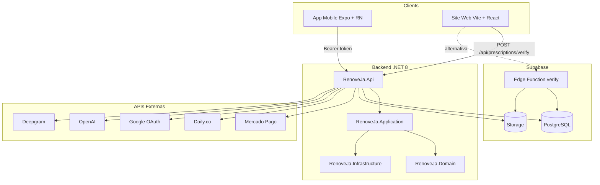

# Análise Ponta a Ponta — RenoveJá+ (ola-jamal)

## 1. Visão geral

**RenoveJá+** é uma plataforma de telemedicina para renovação de receitas, pedidos de exame e consultas por vídeo. O projeto inclui:

- **frontend-mobile**: app React Native (Expo) para pacientes e médicos
- **frontend-web**: site em React (Vite) focado em verificação de receitas
- **backend-dotnet**: API .NET 8 em Clean Architecture
- **supabase**: PostgreSQL, Storage, Edge Functions (Verify v2)

---

## 2. Arquitetura do sistema



---

## 3. Stack tecnológico

| Camada          | Tecnologias principais                                                                                        |
| --------------- | ------------------------------------------------------------------------------------------------------------- |
| **Mobile**      | Expo 54, React Native 0.81, Expo Router 6, React Query, NativeWind (Tailwind), Daily.co (vídeo), SignalR, Zod |
| **Web**         | React 18, Vite 5, React Router 6                                                                              |
| **Backend**     | .NET 8, FluentValidation, Serilog, Swashbuckle (Swagger)                                                      |
| **Infra**       | Supabase (PostgreSQL, Storage, Edge Functions), Npgsql, iText7 (PDF), BouncyCastle, QRCoder, Magick.NET       |
| **Integrações** | Mercado Pago, Google OAuth, OpenAI, Deepgram, InfoSimples (CRM), Daily.co                                     |

---

## 4. Estrutura de pastas

```
ola-jamal/
├── frontend-mobile/          # App Expo (paciente + médico)
│   ├── app/                  # Rotas Expo Router (file-based)
│   ├── components/
│   ├── contexts/
│   ├── hooks/
│   ├── lib/
│   └── types/
├── frontend-web/             # Site verificação (Vite + React)
│   └── src/
│       ├── pages/            # Verify, Cookies, Home
│       └── api/              # verify.ts (POST /api/prescriptions/verify)
├── backend-dotnet/
│   ├── src/
│   │   ├── RenoveJa.Api/           # Controllers, Program.cs
│   │   ├── RenoveJa.Application/   # Services, DTOs, Validators
│   │   ├── RenoveJa.Domain/        # Entities, Interfaces, Enums
│   │   └── RenoveJa.Infrastructure/# Repositories, Storage, Auth, etc.
│   └── tests/RenoveJa.UnitTests/
├── supabase/
│   ├── migrations/           # SQL (prescriptions, RLS, etc.)
│   ├── functions/verify/      # Edge Function Verify v2
│   └── docs/
├── docs/                     # Documentação geral
├── scripts/                  # Utilitários (seed, testes, etc.)
└── .cursor/rules/            # Regras do projeto
```

---

## 5. Rotas e fluxos

### Mobile (Expo Router)

| Grupo        | Rotas principais                                                                                                                                                                                                                                                                                                                |
| ------------ | ------------------------------------------------------------------------------------------------------------------------------------------------------------------------------------------------------------------------------------------------------------------------------------------------------------------------------- |
| **Auth**     | `/(auth)/login`, `/(auth)/register`, `/(auth)/forgot-password`, `/(auth)/reset-password`, `/(auth)/complete-profile`, `/(auth)/complete-doctor`                                                                                                                                                                                 |
| **Paciente** | `/(patient)/home`, `/(patient)/requests`, `/(patient)/record`, `/(patient)/profile`, `/(patient)/notifications`                                                                                                                                                                                                                 |
| **Médico**   | `/(doctor)/dashboard`, `/(doctor)/requests`, `/(doctor)/profile`, `/(doctor)/notifications`                                                                                                                                                                                                                                     |
| **Fluxos**   | `/new-request/` (prescription, exam, consultation), `/request-detail/[id]`, `/doctor-request/[id]`, `/doctor-request/editor/[id]`, `/doctor-patient/[patientId]`, `/payment/[id]`, `/payment/request/[requestId]`, `/video/[requestId]`, `/care-plans/[carePlanId]`, `/consultation-summary/[requestId]`, `/certificate/upload` |
| **Globais**  | `/onboarding`, `/settings`, `/terms`, `/privacy`, `/about`, `/help-faq`, `/change-password`                                                                                                                                                                                                                                     |

### Web (React Router)

| Rota          | Descrição                               |
| ------------- | --------------------------------------- |
| `/`           | Home com link para verificação          |
| `/verify/:id` | Validação de receita (código 6 dígitos) |
| `/cookies`    | Política de cookies                     |

---

## 6. Integração Verify v2 — Duas implementações

O projeto possui **duas implementações** de verificação:

| Aspecto              | Edge Function Supabase                    | Backend .NET                                                                                     |
| -------------------- | ----------------------------------------- | ------------------------------------------------------------------------------------------------ |
| **URL**              | `POST {SUPABASE_URL}/functions/v1/verify` | `POST /api/prescriptions/verify`                                                                 |
| **Body**             | `{ id, code, v? }`                        | `{ prescriptionId, verificationCode }`                                                           |
| **Tabela**           | `prescriptions`                           | `medical_requests` + `prescription_verify_repository`                                            |
| **Código**           | 6 dígitos (somente 0-9)                   | 4 ou 6 dígitos                                                                                   |
| **Resposta sucesso** | `{ status: "valid", downloadUrl, meta }`  | `{ isValid: true, status, issuedAt, signedAt, patientName, doctorName, doctorCrm, downloadUrl }` |

**Frontend-web** usa apenas o backend: `frontend-web/src/api/verify.ts` chama `POST /api/prescriptions/verify` com `prescriptionId` e `verificationCode`.

O backend usa `medical_requests` e `requestRepository`; a Edge Function usa a tabela `prescriptions` do Supabase. O skill RenoveJá+ alignment trata possíveis desalinhamentos entre essas fontes.

---

## 7. Principais fluxos de usuário

### Fluxo receita (paciente → médico → assinatura)

```
Paciente: Home → Nova Receita → Envia (fotos + tipo)
    → Meus Pedidos → Detalhe (Submitted)
Médico:  Dashboard → Fila → Detalhe → Aprovar/Rejeitar
Paciente: Detalhe → Pagar (PIX/cartão)
Backend:  Webhook MP → status Paid
Médico:   Assinar Digitalmente (certificado ICP-Brasil)
Paciente: Detalhe → Baixar Receita → mark-delivered
```

### Fluxo verificação (farmácia/validador)

```
QR Code na receita → /verify/<id>?v=<token>
    → Redirect para frontend-web /verify/:id
Usuário digita código 6 dígitos
Frontend: POST /api/prescriptions/verify
Backend:  Valida verify_code_hash → retorna dados + downloadUrl
```

### Fluxo consulta por vídeo

```
Paciente: Nova Consulta → Pagar
Médico:   Aceitar Consulta → Iniciar Consulta
Backend:  Cria sala Daily.co
Ambos:    Entram na videochamada
```

---

## 8. Backend — Controllers principais

| Controller                  | Rota base           | Principais endpoints                                                                     |
| --------------------------- | ------------------- | ---------------------------------------------------------------------------------------- |
| **AuthController**          | `api/auth`          | POST register, register-doctor, login, login-google; PATCH avatar, change-password       |
| **RequestsController**      | `api/requests`      | POST prescription, exam, consultation; GET (lista); PATCH approve, reject, sign, cancel  |
| **PrescriptionsController** | `api/prescriptions` | POST verify (código 6 dígitos)                                                           |
| **VerificationController**  | `api/verify`        | GET `{id}` (ITI + redirect); POST `{id}/full`; GET `{id}/document`; POST `{id}/dispense` |
| **PaymentsController**      | `api/payments`      | POST (criar pagamento PIX/cartão)                                                        |
| **VideoController**         | `api/video`         | Criação de salas Daily.co                                                                |
| **ConsultationController**  | `api/consultation`  | Fluxo de consulta por vídeo                                                              |
| **DoctorsController**       | `api/doctors`       | Perfil, lista                                                                            |
| **PatientsController**      | `api/patients`      | Perfil paciente                                                                          |
| **CarePlansController**     | `api`               | Planos de cuidado                                                                        |
| **TriageController**        | `api/triage`        | Triagem e assistente IA                                                                  |
| **ShortUrlController**      | `r`                 | GET `r/{shortCode}` → redirect para verify                                               |
| **CertificatesController**  | `api/certificates`  | Certificado digital ICP-Brasil                                                           |
| **NotificationsController** | `api/notifications` | Notificações                                                                             |
| **PushTokensController**    | `api/push-tokens`   | Tokens push (Expo)                                                                       |

---

## 9. Pontos de integração críticos

| Ponto             | Descrição                                                                                                                                                                     |
| ----------------- | ----------------------------------------------------------------------------------------------------------------------------------------------------------------------------- |
| **Verify v2**     | Contrato: URL `/verify/<id>?v=<token>`, código 6 dígitos. Duas implementações: Edge Function Supabase e backend `POST /api/prescriptions/verify`. Frontend-web usa o backend. |
| **CORS Verify**   | `VerifyCors` permite origem do frontend de verificação.                                                                                                                       |
| **Prescriptions** | Tabelas `prescriptions` e `prescription_verification_logs` no Supabase; bucket `prescriptions` para PDFs.                                                                     |
| **Auth**          | JWT Bearer; `AuthContext` no mobile; token em AsyncStorage.                                                                                                                   |
| **SignalR**       | Atualização em tempo real de pedidos (`RequestsEventsContext`).                                                                                                               |
| **Mercado Pago**  | Webhook em `/api/payments/webhook` para confirmação de pagamento.                                                                                                             |

---

## 10. Regras e guardrails

- **Regras .cursor**: Performance, acessibilidade, design system, Verify v2 contract, runbook Windows, mobile-first, guardrails, qualidade core.
- **Guardrails**: não criar chat, não inventar rotas novas, não expor `SUPABASE_SERVICE_ROLE_KEY` no frontend, patches mínimos, sem hardcode de preço/status.
- **Qualidade**: TypeScript strict, loading/empty/error states, lint + typecheck + tests antes de finalizar.

---

## 11. Comandos para rodar

| Projeto     | Comandos                                                          |
| ----------- | ----------------------------------------------------------------- |
| **Backend** | `cd backend-dotnet` → `dotnet build` → `dotnet run`               |
| **Web**     | `cd frontend-web` → `npm i` → `npm run build`                     |
| **Mobile**  | `cd frontend-mobile` → `npm i` → `npm run typecheck` → `npm test` |

---

## 12. Nota sobre openclaw-chat-contexto.md

O arquivo [openclaw-chat-contexto.md](./openclaw-chat-contexto.md) não faz parte do core do RenoveJá+. É contexto de um sistema **OpenClaw** (chat/WhatsApp) que foi removido. Não está integrado ao projeto principal.
